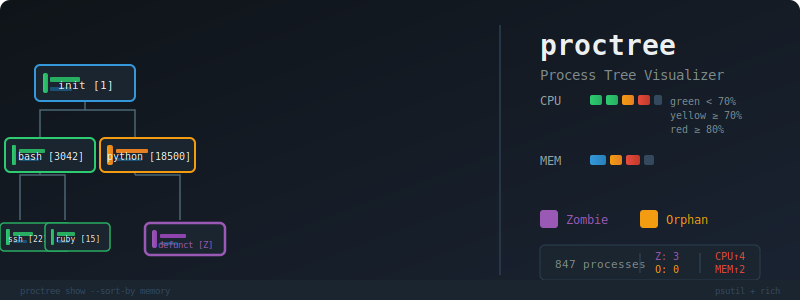

# proctree

<!-- Header SVG -->


<!-- Capsule-render shields.io badge -->
[](https://pypi.org/project/proctree/)
[](https://pypi.org/project/proctree/)
[](LICENSE)
[](https://github.com/izag8216/proctree/actions)

プロセスツリー可視化ツール。リソース注釈付き、ゾンビ検出、Richターミナルレンダリング対応。

## 特徴

- **プロセスツリー可視化**: 親 子プロセスの関係をASCIIツリーで表示
- **リソース監視**: CPU/メモリ使用量をしきい値別にカラー表示（緑/黄/赤）
- **ゾンビ検出**: ゾンビプロセスを`[Z]`マーカーで識別
- **オーファン検出**: オーファンプロセスを`[O]`マーカーで識別
- **リアルタイム監視モード**: 任意間隔でトッププロセスを監視
- **柔軟なフィルタリング**: ユーザー、名前パターン、CPU/メモリしきい値、PIDサブツリーでフィルタ
- **エクスポート**: プロセスツリーをJSON出力

## インストール

```bash
pip install proctree
```

またはソースから:

```bash
git clone https://github.com/izag8216/proctree.git
cd proctree
pip install -e .
```

## クイックスタート

```bash
# フルプロセスツリーを表示
proctree show

# メモリ使用量でソート
proctree show --sort-by memory

# リソースバー非表示
proctree show --no-resources

# 特定プロセスを検索してサブツリーを表示
proctree find python --show-subtree

# PID 1234のサブツリーのみ表示
proctree show --subtree 1234

# ゾンビプロセスを検出
proctree zombies

# トップ10プロセスを監視
proctree watch --top 10 --refresh 2

# JSONでエクスポート
proctree export -o process-tree.json

# プロセス統計を表示
proctree stats
```

## コマンドリファレンス

### `proctree show`

プロセスツリーを表示します。

| オプション | 説明 |
|-----------|------|
| `--sort-by` | ソート順: `pid`, `cpu`, `memory`, `name`, `name_pid` (デフォルト: `pid`) |
| `--max-depth N` | ツリー深度をNレベルに制限 |
| `--no-resources` | CPU/メモリバーを非表示 |
| `--show-cmdline` | 完全コマンドラインを表示 |
| `--user USERNAME` | ユーザー名でフィルタ |
| `--name PATTERN` | プロセス名でフィルタ |
| `--min-cpu PERCENT` | 表示する最小CPU % |
| `--min-mem PERCENT` | 表示する最小メモリ % |
| `--subtree PID` | 指定PIDのサブツリーのみ表示 |

### `proctree find`

プロセス名を検索します。

```bash
proctree find python --show-subtree
```

### `proctree zombies`

ゾンビプロセスを検出します。

```bash
proctree zombies          # 一覧表示
proctree zombies --kill   # ゾンビを強制終了
```

### `proctree watch`

リアルタイムでプロセスを監視します。

| オプション | 説明 |
|-----------|------|
| `--top N` | 表示プロセス数 (デフォルト: 15) |
| `--sort-by` | ソート順: `cpu`, `memory` (デフォルト: `memory`) |
| `--refresh SECONDS` | 更新間隔 (デフォルト: 2.0) |
| `--count N` | 更新回数の上限 |

### `proctree export`

プロセスツリーをJSONでエクスポートします。

```bash
proctree export -o tree.json
```

### `proctree stats`

集約プロセ統計を表示します。

```bash
proctree stats
```

## リソースカラーコード

| カラー | 意味 |
|--------|------|
| 緑 | 正常 (< threshold) |
| 黄 | 注意 (>= 70%) |
| 赤 | 重大 (>= 80%) |

## 必要環境

- Python >= 3.10
- psutil >= 5.9.0
- rich >= 13.0.0

## ライセンス

MIT License

## 作者

izag8216
